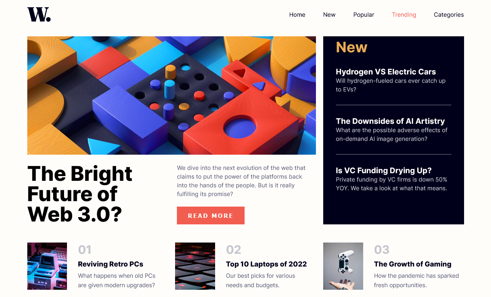

# Solución a "News homepage" - Frontend Mentor

Solución del challenge [News homepage challenge on Frontend Mentor](https://www.frontendmentor.io/challenges/news-homepage-H6SWTa1MFl).

## Tabla de Contenido

- [Introducción](#introduccion)
  - [El Desafío](#el-desafio)
  - [Captura de Pantalla](#captura-de-pantalla)
  - [Links](#links)
- [Mi Proceso](#mi-proceso)
  - [Tecnologías](#tecnologías)
- [Autor](#autor)

## Introduccion

### El Desafío

Your challenge is to build out this news website homepage and get it looking as close to the design as possible.
Crear el homepage de noticias lo más parecido posible al original. Debe ser responsive y ver todos los estados de hover de los elementos interactivos. En el modo mobile debe aparecer el menú desde la derecha una vez se pulse el icono de menú.

### Screenshot

### Links

- Solución URL: [Solución](https://www.frontendmentor.io/solutions/news-homepage-con-grid-of5P8czktE)
- Live Site URL: [Site](https://jcarloscab.github.io/news-homepage-main/)

## Mi Proceso

### Tecnologías

- Grid
- Flexbox
- BEM
- SASS/SCSS

## Autor

- Frontend Mentor - [@jcarloscab](https://www.frontendmentor.io/profile/jcarloscab)
- GitHub - [@jcarloscab](https://github.com/jcarloscab)
